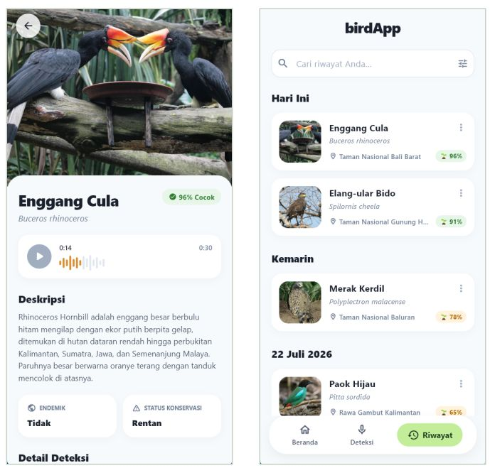
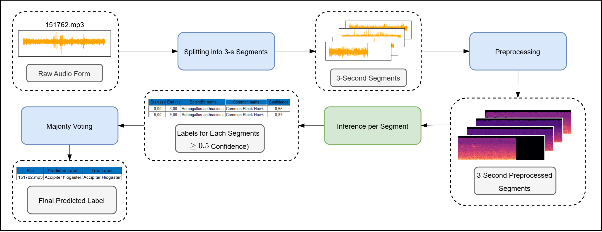
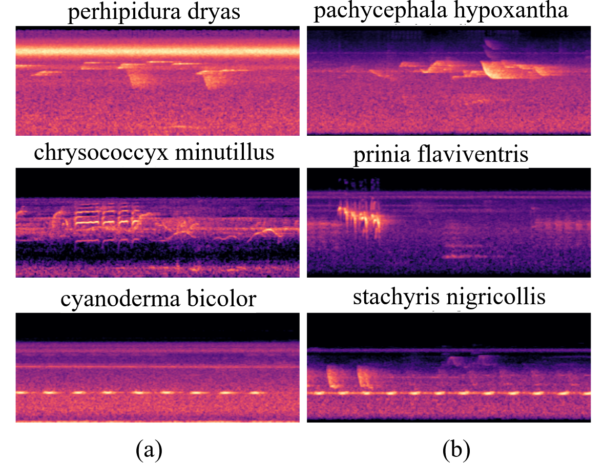
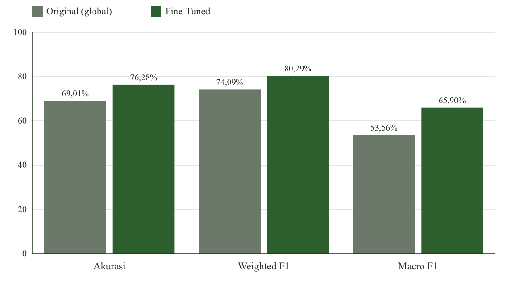
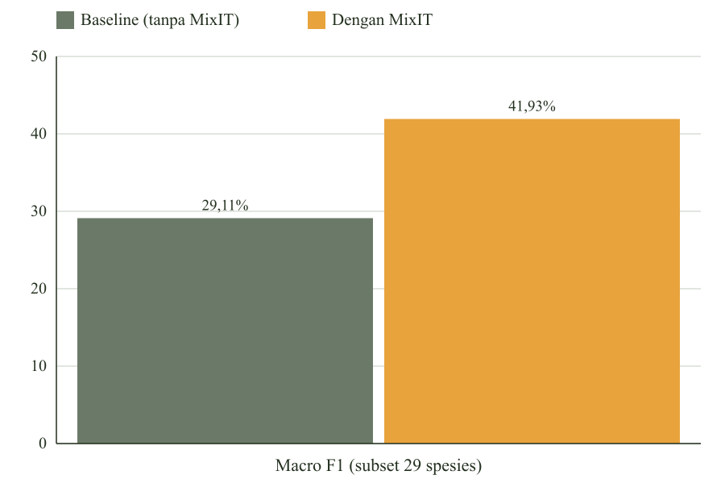
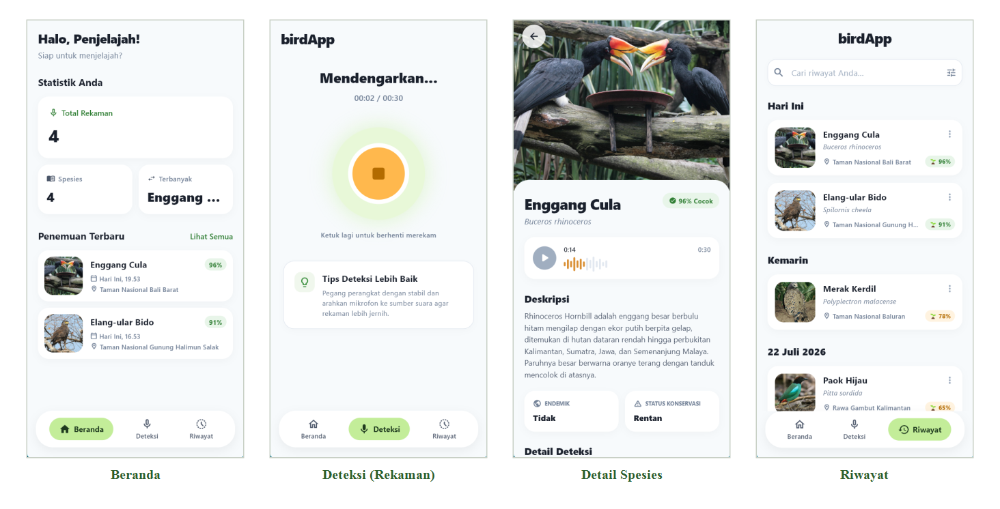
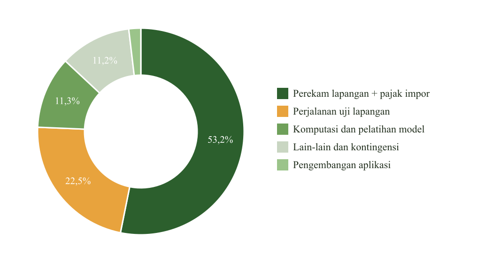

# NUSA Aves



NUSA Aves is one of 80 finalists selected from the proposal round of BRIN
AIDeaNation 2026.

A BirdNET-based classifier identifies endemic and endangered bird species
in Indonesia and Malaysia from short audio clips. This repository packages
the classifier as a self-contained CLI and as a Flutter mobile
application, built for BRIN AIDeaNation 2026.

The training pipeline, including dataset construction, fine-tuning, and
MixIT source separation, is documented at
[github.com/Liamours/Research_Birdsound-Classification_Whisper-Implementation](https://github.com/Liamours/Research_Birdsound-Classification_Whisper-Implementation).

## Quick start

```
docker build -f server/Dockerfile -t nusa-aves .
docker run --rm nusa-aves samples/black_hornbill.wav
```

The model and a few sample clips are bundled in the image. See
[server/README.md](server/README.md) for classifying other audio and for
running without Docker.

## Contents

- **[model/](model/)**: the deployed classifier and its evaluation.
- **[species/](species/)**: the 219 species the model recognizes, with
  their endangerment and endemic-region status.
- **[server/](server/)**: the inference CLI.
- **[mobile-user/](mobile-user/)**: a Flutter application that runs the
  same classifier offline, on device.

## Method



A recording is split into 3-second segments. Each segment is classified
independently; segments with confidence at or above 0.5 are kept, and the
final species label is assigned by majority vote across them.



The classifier operates on log-mel spectrograms. Raw audio is converted to
spectrograms before classification; six example spectrograms from the
training data are shown above.

## Results

Two research phases feed this application. Their publication status
differs, so the results are reported separately.

### Published result



BirdNET was fine-tuned on 200 endemic and endangered species from
Indonesia, Malaysia, and Borneo. On the 200-species test set, fine-tuning
raised accuracy from 69.01% to 76.28%, weighted F1 from 74.09% to 80.29%,
and macro F1 from 53.56% to 65.90%. This result was published as first
author at ICITACEE 2025, IEEE Xplore.

### Unpublished continuation



A separate line of work extends the species list to 219 and adds MixIT
source separation to handle field noise. On a 29-species endemic and
endangered subset, macro F1 rose from 29.11% to 41.93% once MixIT-separated
audio was used. A collaborator leads this manuscript, currently under
revision at JOIV (Journal of Informatics and Visualization) and not yet
accepted; it does not list a NUSA Aves team member as an author.

The model shipped in this repository, `model/CustomClassifier.tflite`, is
the 219-species version. The 219-species count describes what is deployed.
Publication status for each phase is described above.

The fine-tuned model was checked informally at Bandung Zoo and a zoo in Sarawak,
Malaysia, under uncontrolled, high-noise field conditions. Results were
mixed, and this motivated the MixIT work described above.

## Application



The Flutter application runs the classifier on device across four screens:
Beranda (home, recent detections), Deteksi (live recording and detection),
Detail Spesies (species information after a match), and Riwayat (detection
history).

## Budget



Field recorders and import duty account for 53.2% of the proposed budget,
field travel 22.5%, compute and model training 11.3%, contingency and
miscellaneous items 11.2%, with the remainder for application development.
